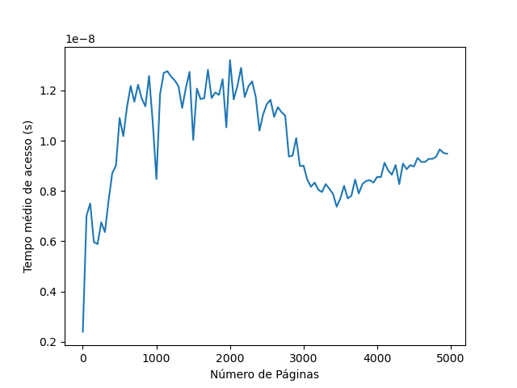
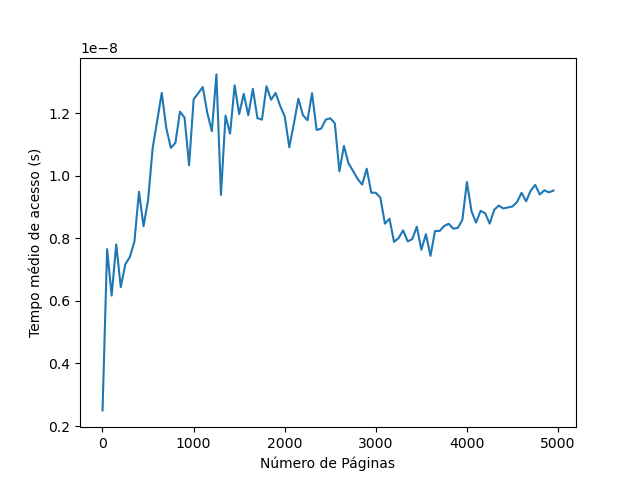
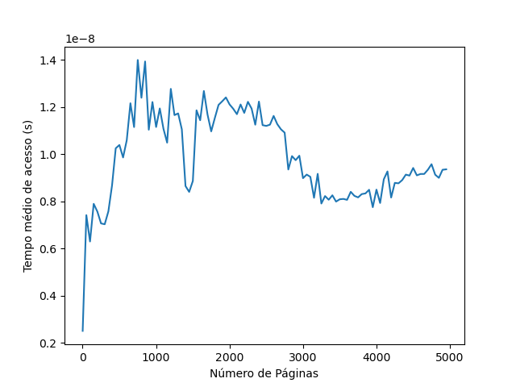
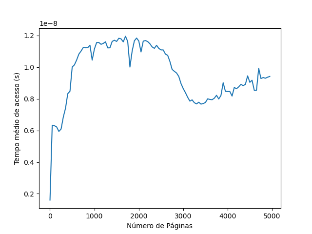
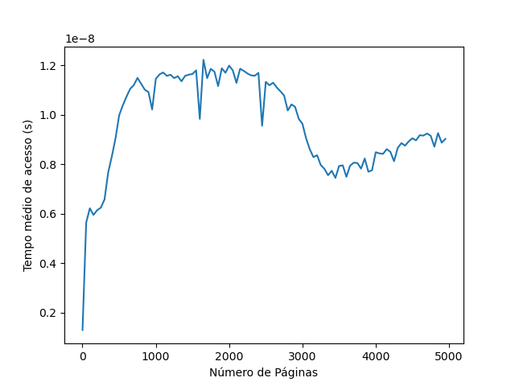
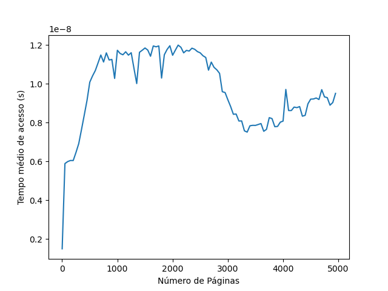

# Trabalho de TLB
André Yudji da Silva Okimoto (22352921), Eduardo Cordeiro da Camara (22352924)

### **Questão 1.** Fazer um programa em C que recebe dois parâmetros: número de páginas P enúmero de iterações I, e este programa deve acessar essas P páginas I vezes, e medir o tempo médio que este processamento leva por acesso.

`Resposta:`

```c++
// Main loop
struct timeval start, end;
gettimeofday(&start, NULL);
for (int i = 0; i < n_iterations; i++) {
    for (int j = 0; j < n_pages; j++) {
        array[j * jump] += 1;
    }
}
gettimeofday(&end, NULL);
double time_diff = get_time_diff(start, end);

// Average time per access
double avg_time = time_diff / ((double)n_iterations * n_pages * jump);

printf("Average time per access (%d pages, %d iterations): %.16lf seconds\n", n_pages, n_iterations, avg_time);
```

Exemplos:

```bash
$ ./LabTLB 10000 20000
Average time per access (10000 pages, 20000 iterations): 0.0000000000014415 seconds

$ ./LabTLB 20000 20000
Average time per access (20000 pages, 20000 iterations): 0.0000000000014666 seconds

$ ./LabTLB 30000 20000
Average time per access (30000 pages, 20000 iterations): 0.0000000000016657 seconds
```

### **Questão 2.** Faça um script para rodar o seu programa com diferentes tamanhos de páginas, indo de 1 até alguns milhares, sempre guardando a média de número de iterações = 10000, e jogue esta saída para um arquivo.

`Resposta:`

Feito o script em python, foi preciso alterar a impressão do programa C, para que ele imprimisse apenas o tempo médio de execução de cada página:

```c++
//Antes
printf("Average time per access (%d pages, %d iterations): %.16lf seconds\n", n_pages, n_iterations, avg_time);

//Depois
printf("%.16lf\n", avg_time);
```

### **Questão 3.** Use o programa plota.py para plotar seu resultado (python3 plota.py nomeArquivoSaida).

Foram calculadas as médias do tempo de acesso para os tamanhos de páginas entre 1 e 5000, dando passos de 50 (1, 51, 101, ..., 4951), com iterações = 10.000, mesmo cenário da questão 2. A partir disso, o script.py roda todos esses experimentos e guarda num output.csv.

Para visualizar, foram feitos três testes e gerados os gráficos. Em todos, o comportamento foi semelhante. Ele começa crescendo rapidamente e se mantém em um intervalo acima. Entre 2000 a 3000 páginas aproximadamente, o tempo médio de acesso começa a cair, e sobe novamente no meio do caminho entre 3000 e 4000, porém com uma subida mais suave. Em todo processo foi possível visualizar um processo bem oscilado, que poderá ser comparado com a questão 4.





`Resposta:`

### **Questão 4:** Algo que pode ter acontecido é que seu processo trocou de CPU durante os escalonamentos (e cada CPU tem uma TLB diferente). Faça com que seu programa rode sempre no mesmo core, adicionando o seguinte comando no início do mesmo:

`Resposta:`

Adicionando as linhas no código:

```c++
#define _GNU_SOURCE
...
#ifdef __linux__
#include <sched.h>
#endif
...
int main(int argc, char **argv) {

#ifdef __linux__
    cpu_set_t mask;
    CPU_ZERO(&mask);
    CPU_SET(0, &mask);
    sched_setaffinity(0, sizeof(cpu_set_t), &mask);
#endif
...
```

Foi possível rodar novamente, nas mesmas condições da questão 3. O comportamento dos gráficos se assemelhou com os da questão 3, com a exceção de que as oscilações foram menores.




